#LinuxPraticeProject

***FILE MANIPULATION***

1. ***sudo command***

    sudo apt upgrade

2. ***pwd command***

    pwd

3. ***cd command***

    cd
    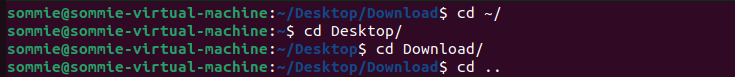
4. ***ls command***

    ls
    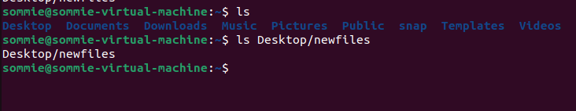
    ls -R
    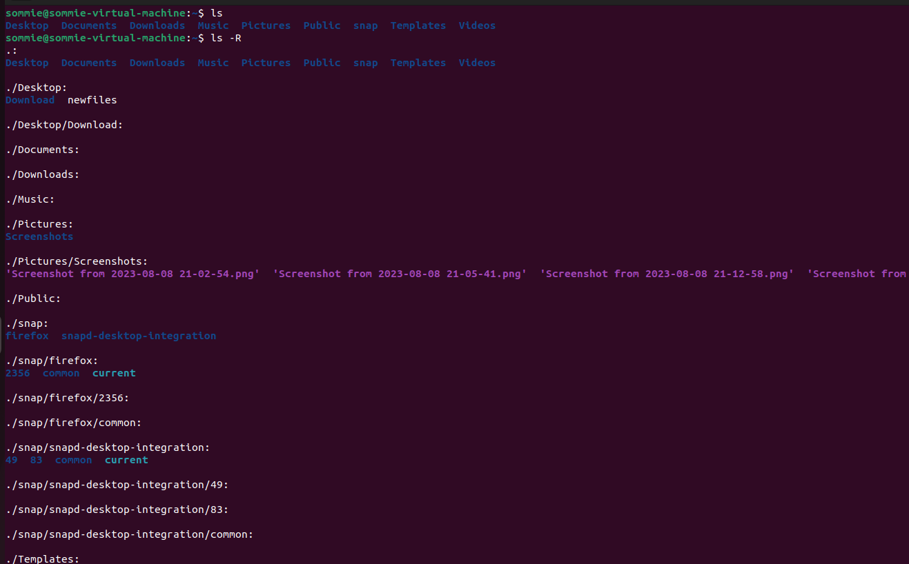
    ls -a
    

5. ***cat command***

    cat
    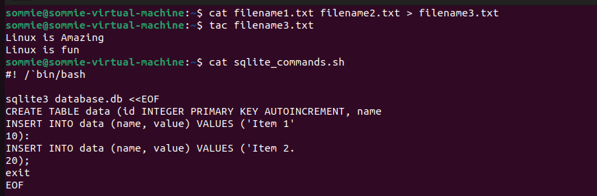

6.  ***cp command***

    cp
    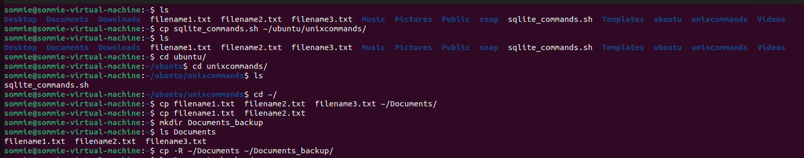

7.  ***mv command***

    mv
    

8.  ***mkdir command***
    
    mkdir
    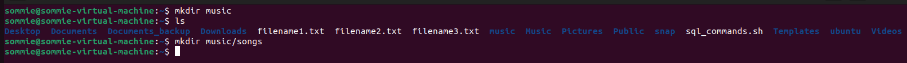

9. ***rmdir command***

    rmdir
    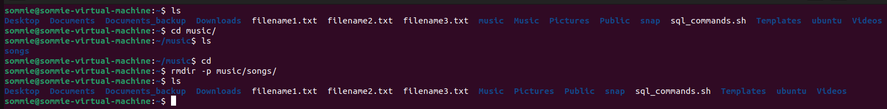

10. ***rm command***

    rm
    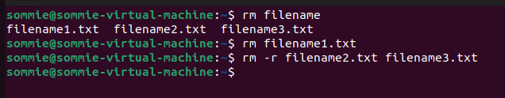

11. ***touch command***

    touch
    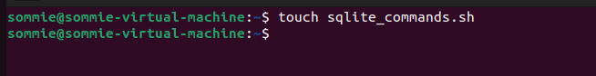

12. ***locate command***

    locate
    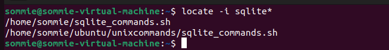

13. ***find command***

    find
    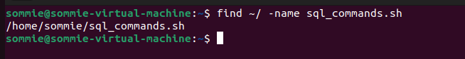

14. ***grep command***

    grep
    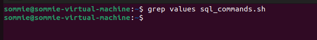

15. ***df command***

    df -h
    

16. ***du command***

    du
    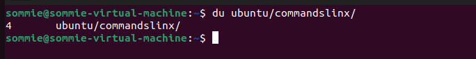

17. ***head command***

    head
    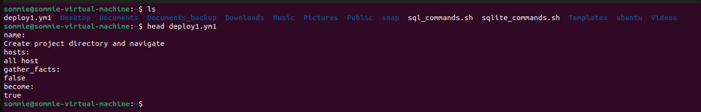

18. ***tail command***

    tail
    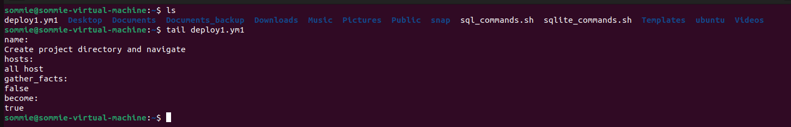

19. ***diff command***

    diff
    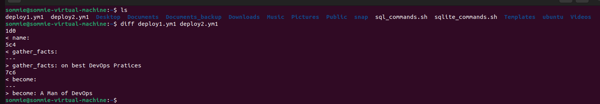

20. ***tar command***

     tar   
    

***FILE PERMISSION AND OWNERSHIP***

21. ***chmod command***

    chmod
    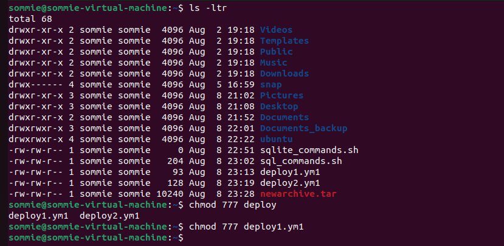

22. ***chown command***

    chown
    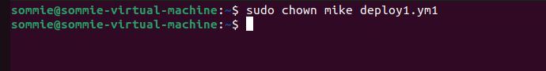

23. ***jobs command***

    jobs
    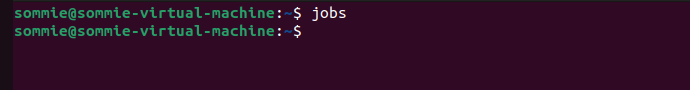

24. ***kill command***

    ps -ux
    
    kill
    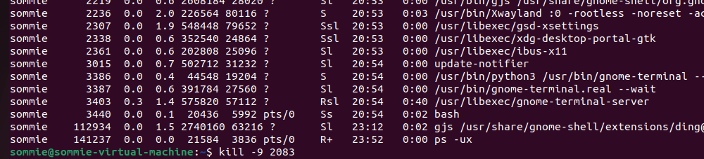

25. ***ping command***

    ping
    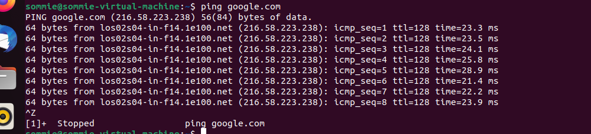

26. ***wget command***

    wget
    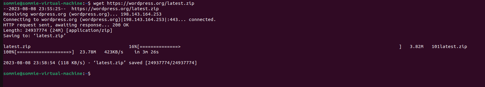

27. ***uname command***

    uname -a
    

28. ***top command***

    top
    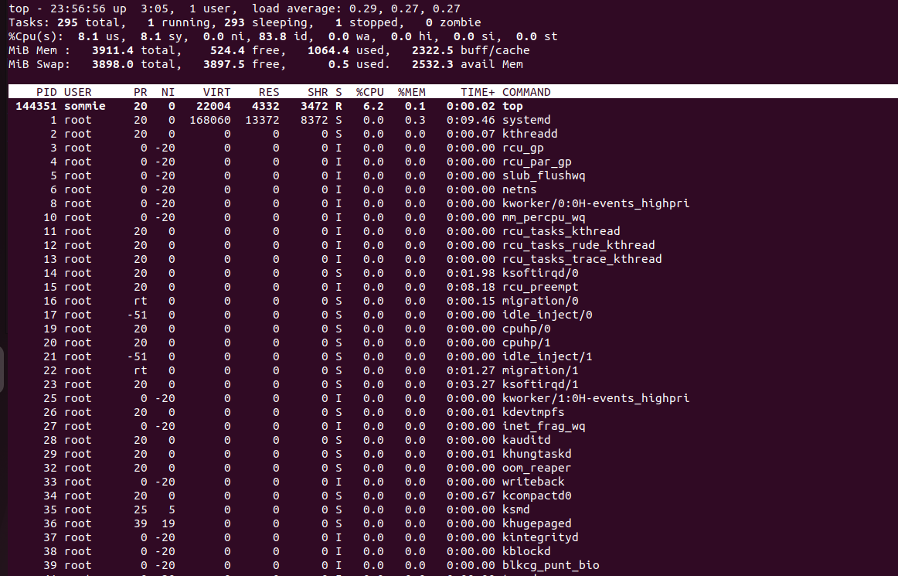

29. ***history command***
    
    history
    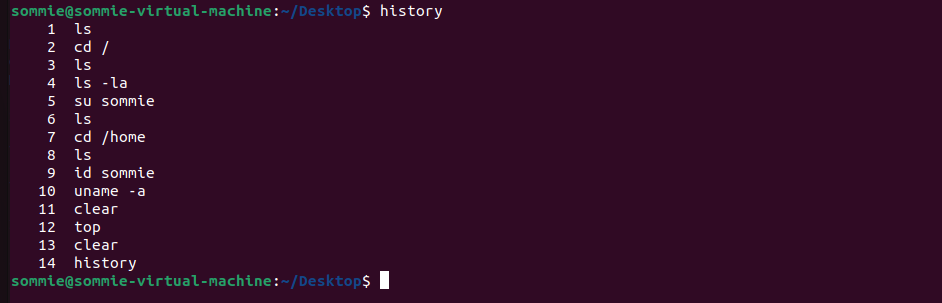

30. ***man command***

    man -ls
    

31. ***echo command***

    echo
    

32. ***zip and unzip command***

    zip and unzip
    

33. ***hostname command***

    hostname
    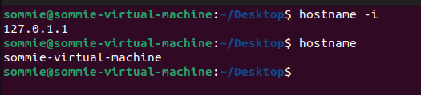

34. ***useradd and userdel commands***

    useradd and userdel
    

35. ***apt-get command***

    apt-get
    

36. ***nano and vi command***

    nano and vi
    
    nano
    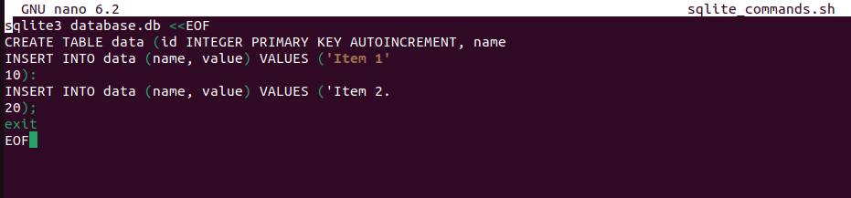
    vi
    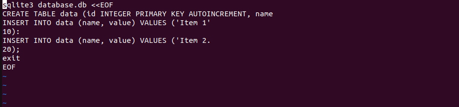

37. ***alias and unalias command***

    alias and unalias
    

38. ***su command***

    su
    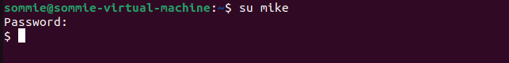

39. ***htop command***

    htop
    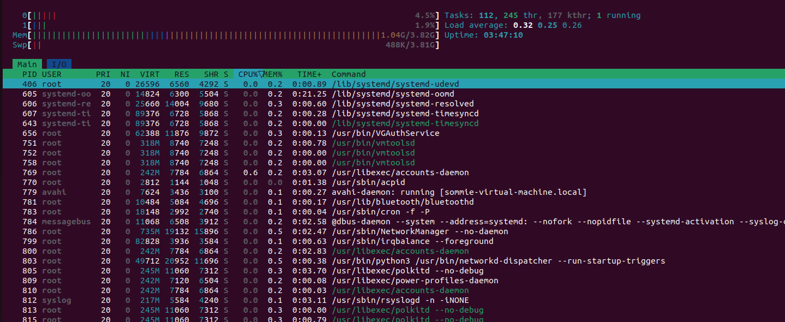

40. ***ps command***

    ps
    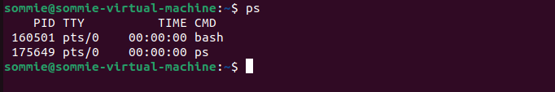

