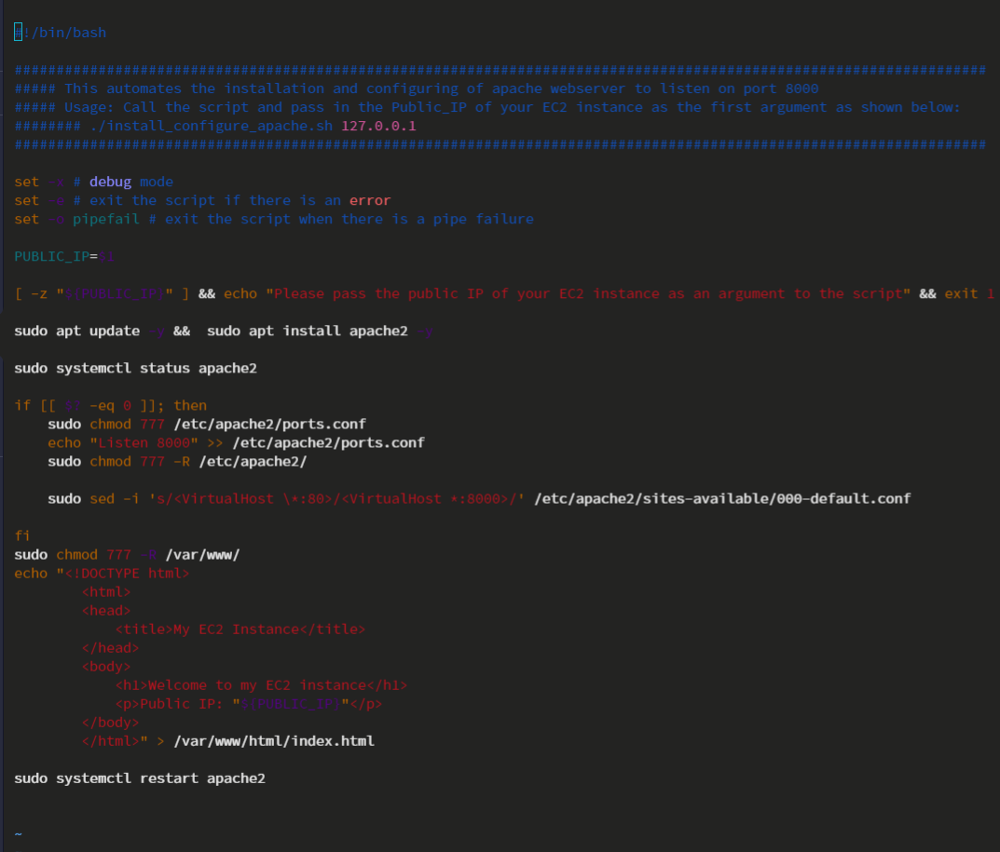
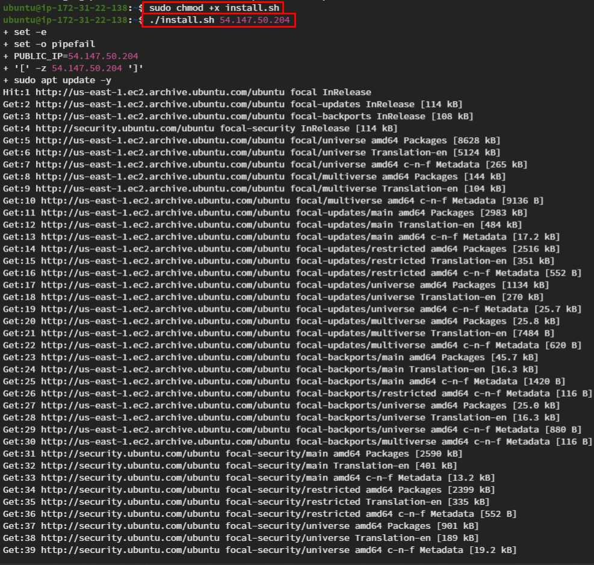
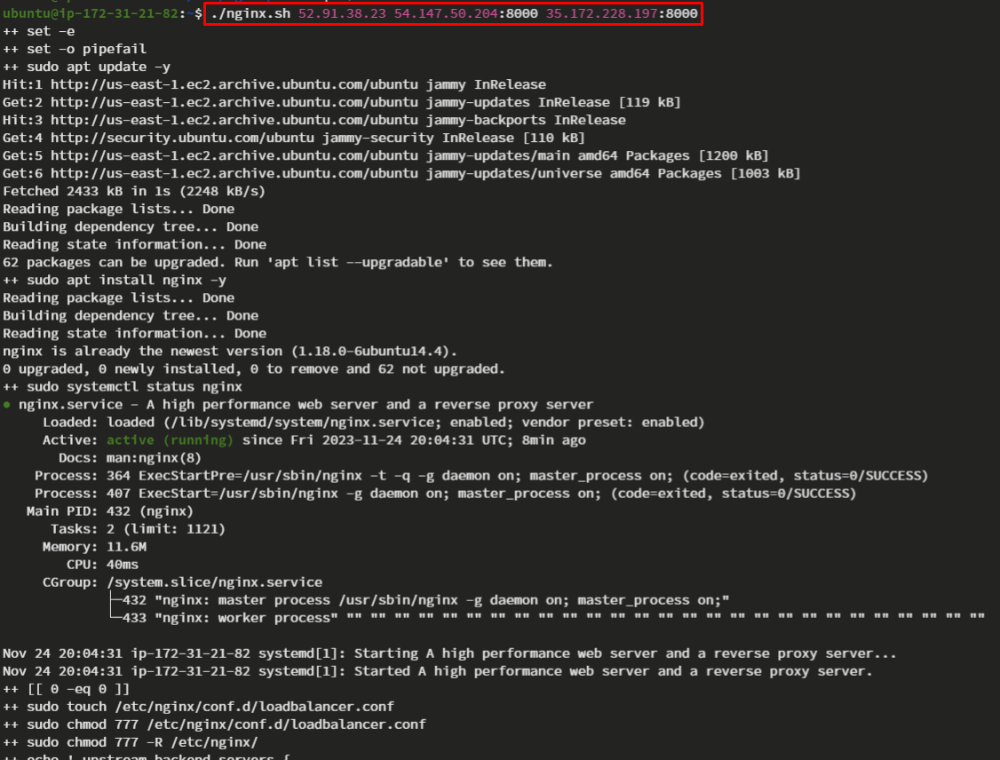
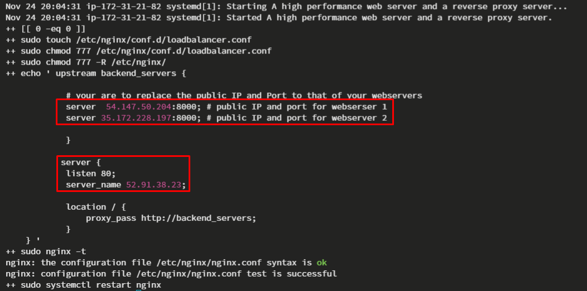
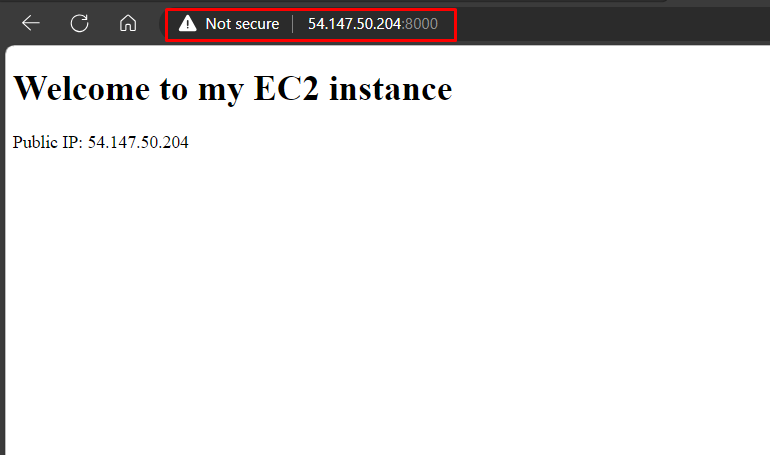
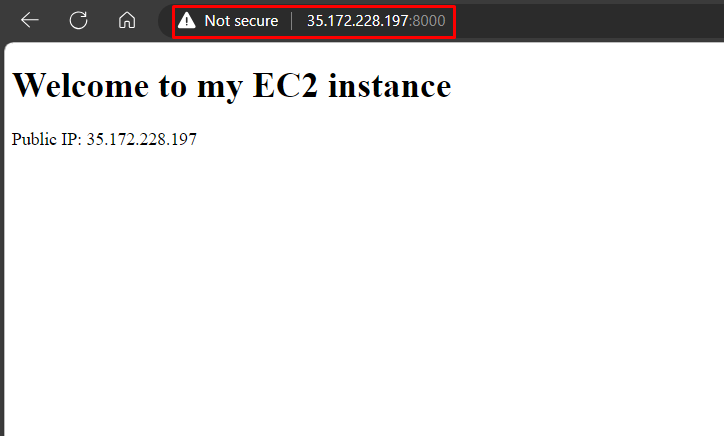
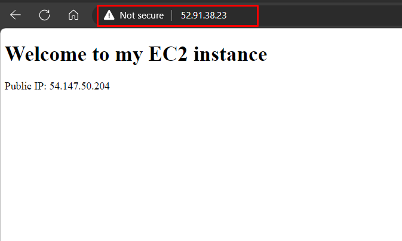
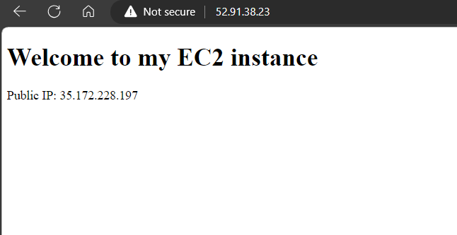

## AUTOMATING LOADBALANCER CONFIGURATION WITH SHELL SCRIPTING

## DEPLOYING AND CONFIGURING THE WEBSERVERS

Create two instances called

**`WebserverA`**

**`WebserverB`**

[Setup an Ec2 instance](https://docs.aws.amazon.com/AWSEC2/latest/UserGuide/EC2_GetStarted.html)

After the two Instances are up and running. permit port 8000 in the inbound rules from the security group for both instances.

Then you can connect to both of the Webservers using ssh.

create and edit the file named install.sh

**`sudo vi install.sh`**

Close the file using the **`esc key then shift + :wqa!`**

Change the permmision on the file to make it executeable using the command below:

**`sudo chmod +x install.sh`**

Then run the script using this command

**`./install.sh 54.147.50.204`** or **`bash install.sh 54.147.50.204`**

## DEPLOYING AND CONFIGURING NGINX LOAD BALANCER

Create an Instance called

**`NGINX LB`**

[Setup an Ec2 instance](https://docs.aws.amazon.com/AWSEC2/latest/UserGuide/EC2_GetStarted.html)

After the Instance is up and running. Make sure to permit port 80 in the inbound rules from the security group.

Then connect to the Nginx LB Instance using ssh.

create and edit file named nginx.sh

**`sudo vi nginx.sh`**

save the file using the command **`esc key then shift + :wqa!`**

Change the permmision on the file to make it executeable using the command below:

**`sudo chmod +x install.sh`**

Then run the script using this command

**`./nginx.sh 52.91.38.23 54.147.50.204:8000 35.172.228.197:8000`** or **`bash nginx.sh 52.91.38.23 54.147.50.204:8000 35.172.228.197:8000`**

The script exceuted further shows the public IPs for the two webservers and the public IP and port for the Nginx Load balancer.

Then don't forget to permit port 80 on the Nginx load balancer from the security group. then browse the public Ip of the Webservers on port 8000 that was earlier permitted.

Then browse the public Ip of the Nginx server on port 80

The deployment is successful because when you refresh the webpage of the Nginx server it switches to the Public Ip of either of the two webservers interchangeably. it means that Nginx is serving as a loadbalancer that can send requests to either of the two webservers to process.

## THANK YOU!!